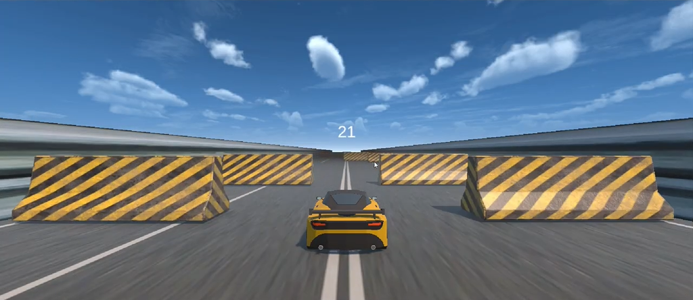
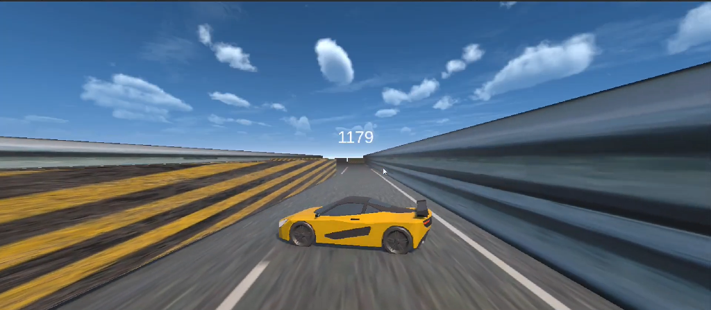

# 3D Car Runner

**Driving / Obstacle-Dodge Prototype | Unity | C#**

A fast-paced 3D driving prototype focused on movement, obstacle avoidance, and score-based gameplay.

---

## Gameplay Mechanics
* **Vehicle Movement:** Smooth acceleration, steering, drifting feel, and braking mechanics.
* **Camera System:** High-speed camera follow tracking vehicle orientation and drifts.
* **Collision Detection:** Precise physics-based collisions against track barriers and obstacles.
* **Obstacle Course:** Alternating hazard barricades testing player reaction time.
* **Score Tracking:** Distance and speed-based score accumulation with escalating challenge.

---

## Screenshots

  
  

