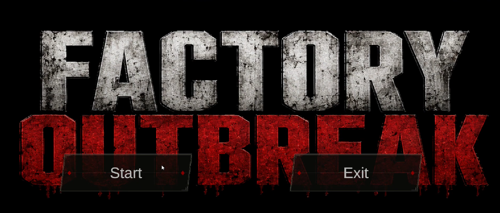
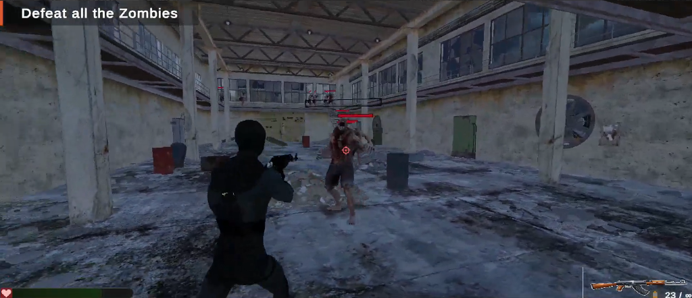
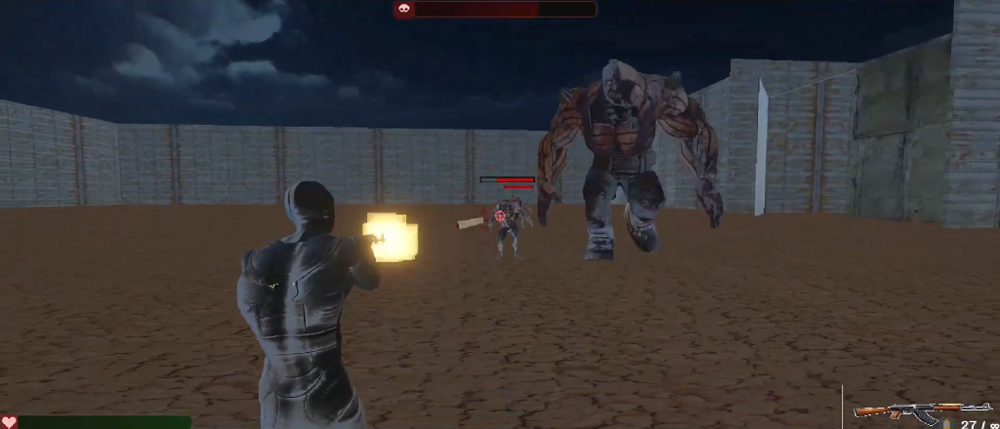

# Game Development Portfolio

**Unity • C# • Gameplay Programming • AI • 3D Game Development**

I'm **Atharv**, a 2nd-year student at **IIT Delhi** exploring game development through hands-on projects and prototypes.

I got started with 3D game development through the **CSOT Game Dev** initiative by **CAIC, IIT Delhi**, and have since worked on multiple Unity projects involving gameplay programming, enemy AI, combat systems, animation, UI, and 3D environments.

I particularly enjoy building games that feel good to play and look visually engaging — treating visual presentation, atmosphere, and gameplay as equally important parts of the experience.

---

## Featured Projects

### Stranded
**3D Puzzle-Adventure | Unity | C#**

A short 3D puzzle-adventure game where the player wakes up stranded on a tropical island and must repair an abandoned boat to escape.

#### Gameplay:
* Explore a 3D island environment
* Find the missing boat components
* Solve environmental objectives
* Interact with objects and the environment
* Navigate hazards and manage player movement

#### Implemented:
* Third-person player controller
* Camera & movement systems
* Interaction system
* Collectible/objective mechanics
* Environmental puzzle logic
* UI and game-state handling
* 3D environment setup

**[Play Stranded on itch.io](https://silentatharv90.itch.io/stranded)** • **[Project Details](Stranded/README.md)**

---

### Factory Outbreak
**Third-Person Zombie Shooter | Unity | C#**

A third-person combat prototype set inside an abandoned industrial environment. The player fights through waves of enemies before facing a dedicated boss encounter.

#### Gameplay Systems:
* Third-person shooting
* Weapon & ammunition system
* Enemy waves
* Zombie combat
* Boss encounter
* Player health & damage
* Respawn system

#### AI & Combat:
* Unity NavMesh-based enemy navigation
* Enemy chasing and target detection
* Enemy health and damage handling
* Boss attack behaviour
* Boss health system
* Hit feedback
* Combat animations

#### Animation & Presentation:
* Animator state machines
* Blend Trees
* Mixamo animation integration
* Boss attack animations
* Muzzle flash & particle effects
* Environmental lighting
* 3D environment composition

*This project pushed me further into gameplay programming, AI behaviour, animation systems, and visual presentation.*

**[Project Details](Factory-Outbreak/README.md)**

---

### 3D Car Runner
**Driving / Obstacle-Dodge Prototype | Unity | C#**

A fast-paced 3D driving prototype focused on movement, obstacle avoidance, and score-based gameplay.

#### Implemented:
* Vehicle movement
* Steering and acceleration
* Camera follow
* Collision detection
* Obstacle courses
* Score tracking
* Increasing gameplay challenge

**[Project Details](Car-Runner/README.md)**

---

## Technical Skills

### Game Development
* Unity
* C#
* 3D Gameplay Programming
* Character Controllers
* Third-Person Controllers
* Game State Management
* Physics & Collision Systems
* Interaction Systems

### Game AI
* Unity NavMesh
* Enemy Pathfinding
* Target Detection
* Enemy Chase Behaviour
* Enemy Attack Behaviour
* Boss AI & Attack Patterns
* Wave-Based Enemy Systems

### Combat Systems
* Raycast-based shooting
* Weapon systems
* Damage & health systems
* Health bars
* Ammunition systems
* Hit detection
* Respawn systems
* Boss encounters

### Animation
* Unity Animator
* Blend Trees
* Animation State Machines
* Mixamo
* Character animation integration
* Combat animations

### Visual Development
* 3D Environment Design
* Lighting & Atmosphere
* VFX & Particle Systems
* Environmental Props
* Camera Composition
* Blender
* 3D Asset Integration

### UI
* Unity UI
* TextMeshPro
* HUD systems
* Health & ammo displays
* Objective prompts
* Menus
* Game-over / victory states

---

## Tools & Technologies

| Category | Technologies |
|---|---|
| **Game Engine** | Unity |
| **Programming** | C# |
| **3D** | Blender |
| **Animation** | Unity Animator, Mixamo |
| **AI** | Unity NavMesh |
| **UI** | Unity UI, TextMeshPro |
| **Version Control** | Git, GitHub |

---

## Screenshots

### Stranded

  
    
  
  
    
  
  

### Factory Outbreak

  
    
  
  

### 3D Car Runner

  
  

---

## Gameplay & Development

Gameplay clips and development demonstrations:

**[Gameplay Videos & Demos (Google Drive)](https://drive.google.com/drive/folders/1mzF1K4KZytsLBppzAxHQsm0fgnK46bP9?usp=drive_link)**

---

## What I'm Currently Exploring

I'm continuing to expand my skills in:
* Advanced enemy AI
* More complex boss behaviours
* Better combat systems
* Advanced animation systems
* 3D environment art
* VFX and game feel
* Game optimization
* Procedural gameplay systems
* AI-driven gameplay

My long-term goal is to combine strong gameplay programming with high-quality visual presentation to create polished 3D game experiences.

---

## About Me

**Atharv Sharma**  
Civil Engineering • IIT Delhi  

I'm interested in **Game Development, AI/ML, Software Development, and 3D Graphics**.

Game development started as something I explored alongside academics, but it has become one of the areas where I enjoy experimenting the most — especially when I can combine programming, visual design, animation, and problem-solving into a playable experience.

---

## Links

* **[itch.io](https://silentatharv90.itch.io/)**
* **[GitHub](https://github.com/valo-max)**
* **[IIT Delhi](https://home.iitd.ac.in/)**

Thanks for checking out my work!  
I'm always experimenting, building, and learning something new. If you're interested in game development, feel free to explore the projects above.
