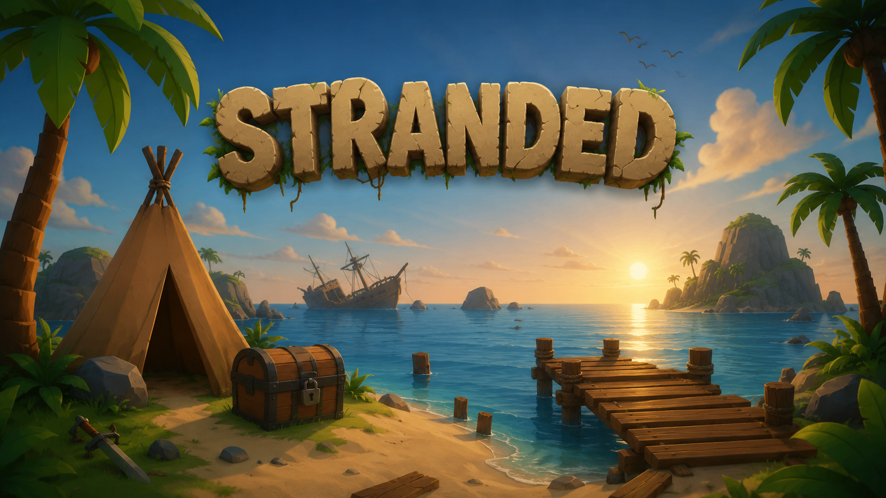
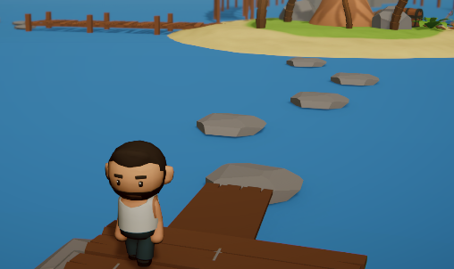
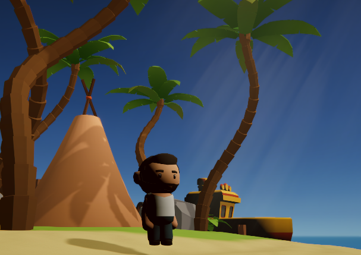
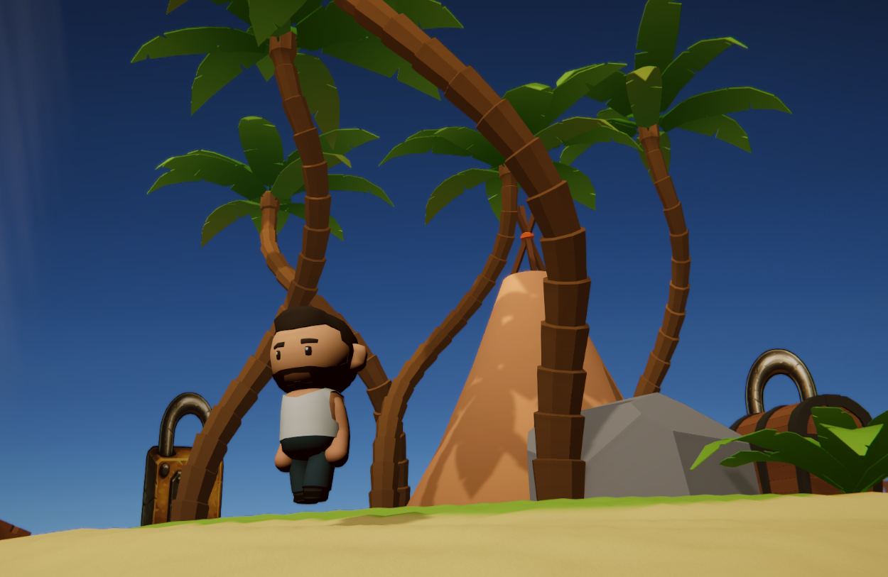

# Stranded

**3D Puzzle-Adventure | Unity | C#**

A short 3D puzzle-adventure game where the player wakes up stranded on a tropical island and must repair an abandoned boat to escape.

**[Play Stranded on itch.io](https://silentatharv90.itch.io/stranded)**

---

## Gameplay & Objective
* **Premise:** You wake up alone on a mysterious tropical island. The only way home is to repair an abandoned boat.
* **Component Retrieval:** Explore the handcrafted island to find three critical boat parts, each hidden behind distinct environmental hurdles:
  * Boat Key
  * Fuel Tank
  * Engine
* **Environmental Hazard:** Falling into deep ocean water resets the run, requiring careful spatial navigation and movement control.

---

## Controls
* **WASD** – Player Movement
* **Mouse** – Look Around / Camera
* **Left Shift** – Sprint
* **Space** – Jump
* **E** – Interact (Collect components / Repair boat)
* **Esc** – Pause Menu

---

## Systems Implemented
* Third-person character controller
* Cinemachine camera & smooth movement systems
* Interaction trigger system with prompt feedback
* Collectible & objective progress tracking
* Environmental puzzle logic and water hazard resets
* Audio, UI, and game-state handling (Pause, Game Over, Win)
* 3D environment composition, atmospheric lighting, and water shader

---

## Screenshots

  
    
  
  
    
  
  

